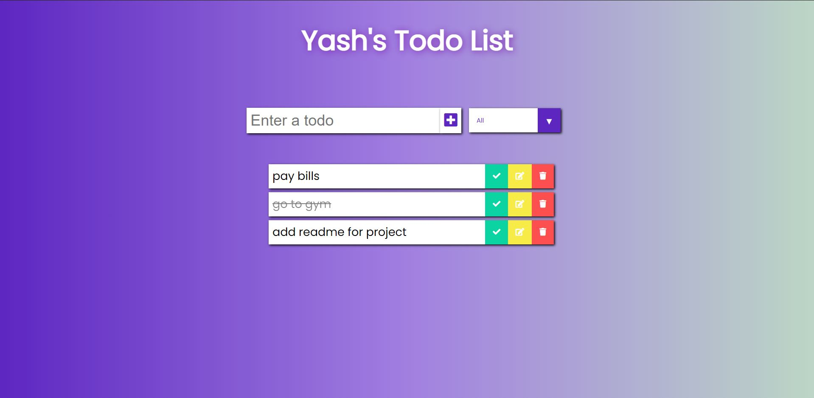

# Todo App

- A todo app built using React. Uses functional components, hooks and localStorage.
- A new todo can be added or an existing todo can be marked as completed, can be updated if needed or can be deleted if no longer needed.
- Todos can be filtered out based on their status of completed or uncompleted.
- App is made responsive for better rendering in all devices.
